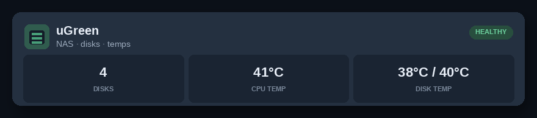
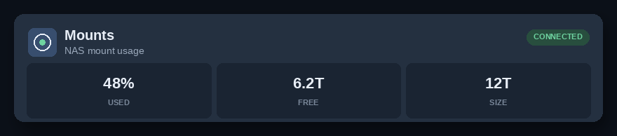
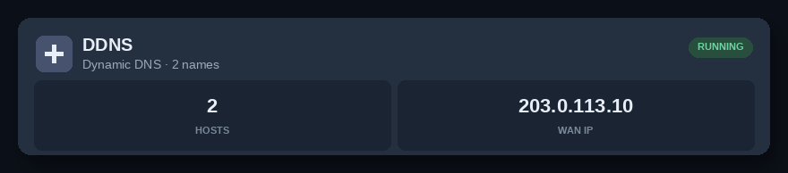
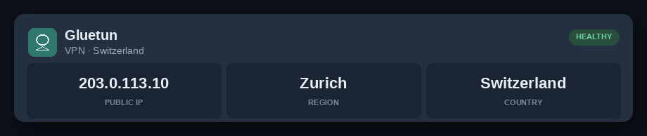
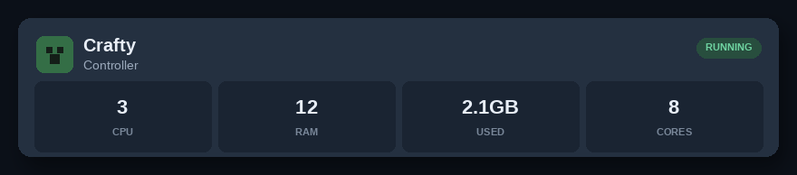
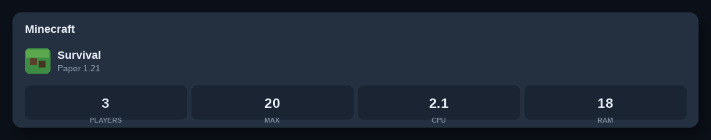
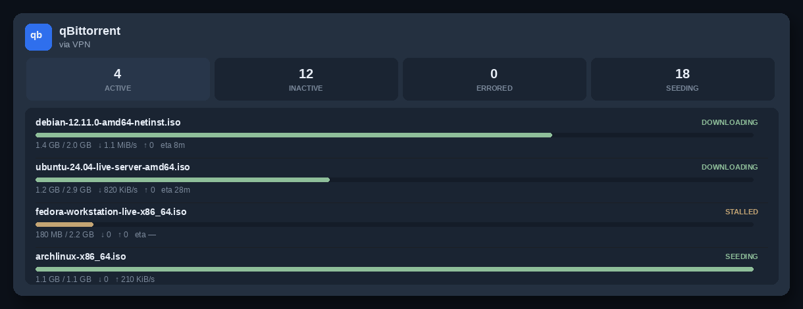

# homepage-widgets

Custom [Homepage](https://gethomepage.dev) cards and iframe widgets for a home-lab dashboard.

**Start here:** [Add these widgets to Homepage](homepage/README.md) — where to paste YAML, Docker network, `custom.js`, layout.

Nothing secret belongs here. NAS username/password stay in `ugreen.auth` on the server (gitignored). Crafty API tokens and Gluetun keys stay in gitignored files too. Do not commit LAN IPs, cookies, instance names, or tokens.

## Preview

Sanitized mockups — placeholder names, [RFC 5737](https://www.rfc-editor.org/rfc/rfc5737) IPs, distro ISOs. Not a live dashboard.















## Cards

| Card | Kind | Process | Browser talks to |
| --- | --- | --- | --- |
| **qBittorrent** | iframe widget | `qbit-widget` (nginx) | widget origin only (`/api/v2` → qBit via Docker network) |
| **uGreen** | Homepage `customapi` | `ugreen-api` | Homepage → `ugreen-api:9199` |
| **Mounts** | Homepage `customapi` | `ddns-status` | Homepage → `ddns-status:8791/mounts.json` |
| **DDNS** | Homepage `customapi` | same `ddns-status` | Homepage → `ddns-status:8791/ddns.json` |
| **Gluetun** | Homepage `customapi` | `gluetun-status` | Homepage → `gluetun-status:8792/` |
| **Crafty / Minecraft** | iframe widget | `crafty-widget` | widget origin only (`/api/summary` → Crafty from the sidecar) |

Status pills for uGreen / Mounts / Gluetun are rewritten by [`homepage/custom.js`](homepage/custom.js), which only calls Homepage's own `/api/services/proxy`.

## Tutorials

1. [Add to Homepage](homepage/README.md)
2. [qBittorrent iframe](sidecars/qbit-widget/README.md)
3. [uGreen NAS temps](sidecars/ugreen-api/README.md)
4. [Mounts + DDNS](sidecars/ddns-status/README.md)
5. [Gluetun VPN](sidecars/gluetun-status/README.md)
6. [Crafty Minecraft](sidecars/crafty-widget/README.md)

Compose fragments to merge into an existing stack: [`sidecars/compose.fragment.yml`](sidecars/compose.fragment.yml).

Homepage YAML snippets: [`homepage/`](homepage/). Full example: [`homepage/services.example.yaml`](homepage/services.example.yaml).

## Shared prerequisites

- Docker
- [Homepage](https://gethomepage.dev) with a `config/` volume
- Sidecars on the **same Docker network** as Homepage so widget URLs like `http://ugreen-api:9199/` resolve

Copy `custom.js` into Homepage's config if you want HEALTHY / CONNECTED pills:

```bash
# on the Homepage host
cp homepage/custom.js /path/to/homepage/config/custom.js
```

The group name in `custom.js` (`Infra`) must match the group title in `services.yaml`.

## Security checklist

- [x] No LAN IPs in defaults (`NAS_HOST` / `HOMEPAGE_HOST` / `GAME_HOST` placeholders only)
- [x] No passwords, UGOS tokens, Crafty tokens, or Gluetun keys in git
- [x] qBit widget uses empty `QBIT_USER` / `QBIT_PASS` and same-origin `/api/v2`
- [x] Crafty iframe uses same-origin `/api/summary` (token stays in the sidecar)
- [x] `ugreen.auth`, `*.token`, `crafty.token`, and `.env` are gitignored
- [ ] On your server: whitelist the Docker subnet in qBittorrent instead of baking credentials into HTML
- [ ] On your server: set `UGOS_URL`, `CRAFTY_URL`, bind-mounts; never push those values back here

## Health thresholds (uGreen)

- **Healthy** — disks status 1, CPU < 70 °C, hottest disk < 45 °C
- **Warning** — CPU ≥ 70 or disk ≥ 45
- **Critical** — disk not status 1, CPU ≥ 85, or disk ≥ 55
